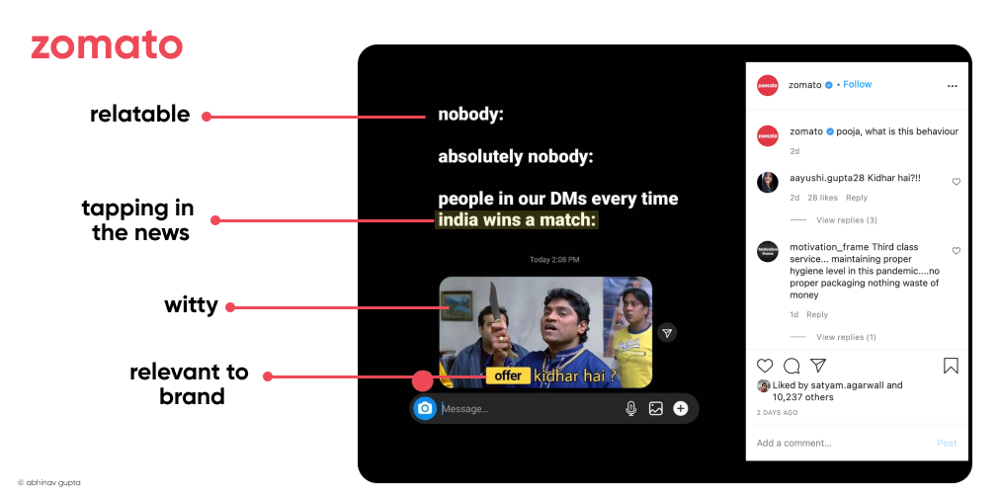

Content marketing is the new normal right now. Every brand, every startup, every product has a content strategy defined for them.

According to CMI, 91% of brands are doing it the wrong way.

&nbsp;

&nbsp;

### But what these 91% brands lack? 🧐

Most of the brands don't focus on giving valuable content at first. Their starting point is the distribution rather than the content.

Most brands think spending time and money on strategizing isn't worth the effort.

Most of them think of instant ROI, rather than a long term game plan.

They aren't consistent with what content they post. Brands ignore the comments, feedback.

Brands ignore the analytics and numbers.

Brands ignore the value of being empathetic.

Above all, most of the time they don't create valuable content.

&nbsp;

&nbsp;

### Why Content is so important? 😲

With advancement of AI, running ads would be damn easy.  You'll get pre made target audiences and ad-sets.  

So what will happen?

The marketing teams would take a step back and focus on the strategy part. (Go back to your Drawing board!)

Creative and content strategy would become more important. C

Content Marketing is a low cost activity. It purchases you high value attention and appreciation.

78% of CMOs believe custom content is the future of marketing. (Source: DemandMetric)

&nbsp;

&nbsp;

### But What to do? 👀

Ever sowed and grown seeds? 

You sow many seeds with an expectation of getting fruits. Some seeds grow and nurture and some don't. 

The grown-up seeds then bore fruit. 
This is end result you aspire for as a human. 

Consider your Brand as this human!
Now, content pieces are your seeds. You sow them with an expectation of getting users (the fruit). 

Some content pieces nurture and some don't. And the mature seeds bore fruit i.e the users.

But which seeds grow?
Seeds that are well-nourished and taken care of.

So make sure the content seed you grow is well nourished with value for it to explode a deliver a fruit.

&nbsp;

&nbsp;

What are some actionable steps?

- As the name suggests, focus on content first, then marketing. Duh

- Publish great content first, market second.

- Give your users something worthwhile to read. Make your content as a bridge to achieve their aspirations and solve their problems.

- Write what potential customers want to read.

- Keep your content brand and product relevant.

- Have a strong opinion. Opinion doesn't mean being contrarian and angry. It's your point of view that aligns with your brands vision.

- Write down your content goals and never loose sight of them.

- Give value first → Nurture → Convert

&nbsp;

&nbsp;

### Some Good examples of Content Marketing by Indian Brands 👏🏻

&nbsp;

&nbsp;

&nbsp;

&nbsp;

So my closing thoughts are,

> Share our latest, freshest understanding of the world with your users and they would reward us with their attention.

&nbsp;

&nbsp;

Phew! That was a long one. Thanks for reading.

If you found it useful, please do share with your pals. If you have any feedback, my [Twitter DM](https://twitter.com/abhnvx) is always open.

Over and Out - Abhinav 👋🏻
